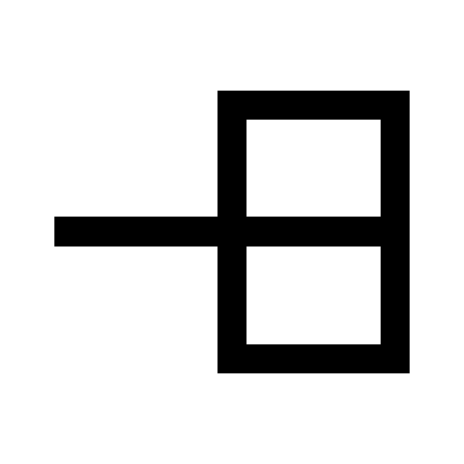

# Contour

## Give your App some contour

Contour offers a set of components, hooks and utility functions, that help give your app some
contour.
We recommend keeping your layout contour at a minimum. If you feel that you have to adjust Contour's
core components, then this is either the wrong tool or you're overthinking it.

Contour was built to allow a KISS solution for layout. It closely follows the recommendations of
[material design](https://material.io/design/layout/responsive-layout-grid.html#columns-gutters-and-margins)
and can be used in [combination with Material-ui](https://contour-rust.vercel.app/?path=/story/examples-with-other-libraries--material-ui)
or similar libraries with ease.

Read more about the core values of Contour: https://contour-rust.vercel.app/?path=/story/introduction--page

## Why should I use this instead of Material UI's Grid?

We love [Material-ui](https://mui.com) but the [Grid](https://mui.com/components/grid/#main-content)
implementation doesn't satisfy our expectations.

With [v5](https://mui.com/blog/mui-x-v5/) Material-ui added a lot of improvements. Contour picked up
some beautiful parts of their API, the Grid however still has several disadvantages.

Contour is built for nesting, it inherits valuable information from its ancestor components.  
**Read more about it here:** https://contour-rust.vercel.app/?path=/story/introduction--page#inheritance-of-column-count

Furthermore, contour allows you to switch between `grid` and `flex`.  
**Read more about it here:** https://contour-rust.vercel.app/?path=/story/introduction--page#grid-vs-flexbox

Contour has been going through a long process of prototyping. Over ten similar systems taught us
how to build the ~~perfect~~ Grid (don't say perfect, it suggests that you gave up on improvement).

The main idea existed long before Material-design existed, and we are happy that some smart people
came to the same conclusion as us.

The latest versions of the prototypes are built on css-variables. Due to this, we were able to keep
the CSS logic at a minimum. The Core idea was built in only 11 lines of CSS.

Watch a video about the core of this library:

## Next Generation Grid System

| version                                    | description               |
|:-------------------------------------------|:--------------------------|
| [![contour react][contour-badge]][contour] | The core components       |
| [![contour theme][theme-badge]][theme]     | Theming tools             |
| [![contour utils][utils-badge]][utils]     | Utilities tools and types |
| [![contour hooks][hooks-badge]][hooks]     | Hooks to enhance contour  |

[contour-badge]: https://img.shields.io/npm/v/@contour/react?style=for-the-badge
[theme-badge]: https://img.shields.io/npm/v/@contour/theme?style=for-the-badge
[hooks-badge]: https://img.shields.io/npm/v/@contour/utils?style=for-the-badge
[utils-badge]: https://img.shields.io/npm/v/@contour/hooks?style=for-the-badge
[contour]: https://www.npmjs.com/package/@contour/react
[theme]: https://www.npmjs.com/package/@contour/theme
[utils]: https://www.npmjs.com/package/@contour/utils
[hooks]: https://www.npmjs.com/package/@contour/hooks
